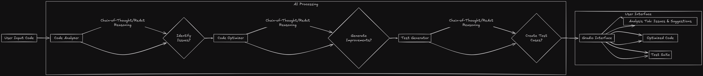

# CoDSPy: AI-Powered Code Optimizer & Reviewer

[](https://www.python.org/)
[](https://gradio.app/)

## 🧙‍♂️ Project Overview
CoDSPy is an intelligent code optimization system that combines AI analysis, automated refactoring, and test generation into a single workflow. Built with DSPy and Gradio, it transforms raw code into optimized, test-covered implementations through **Chain-of-Thought (CoT)** and **ReAct reasoning**.


## ✨ Key Features
- **AI-Powered Code Analysis**: Detects potential issues using **CoT** and **ReAct reasoning**
- **Smart Optimization**: Suggests and implements code improvements
- **Test Generation**: Creates comprehensive test cases and code
- **Interactive Interface**: Gradio-based web UI with real-time results
- **Local AI Integration**: Runs on Ollama with custom LLM models
- **Multiple Implementations**: Supports both **CoT** and **ReAct** approaches

## 🗂️ Project Structure
```
.
├── README.md                   # Project documentation
├── testcodes.py                # Sample test codes for evaluation
├── v1_CoT_CodeLlama.py         # CoT implementation with CodeLlama 7B 
├── v2_CoT_Llama.py             # CoT implementation with Llama 3.2:3B
└── v3_ReAct.py                 # ReAct implementation with Llama 3.2:3B
```

## 🚀 Getting Started

### Prerequisites
- Python 3.8+
- Ollama installed locally
- Llama3 or compatible LLM model configured

### Installation
```bash
git clone https://github.com/yourusername/CoDSPy.git
cd CoDSPy
pip install -r requirements.txt
```

### Quick Start
1. Start Ollama service:
```bash
ollama serve
```

2. Run the desired implementation:
```bash
# For CoT with CodeLlama:7b
python v1_CoT_CodeLlama.py

# For CoT with Llama 3.2:3b
python v2_CoT_Llama.py

# For ReAct with Llama 3.2:3b
python v3_ReAct.py
```

3. Access the interface at `http://localhost:7860`

## 🛠️ Workflow Process
1. **Code Analysis Phase**:
   - Syntax inspection
   - Performance evaluation
   - Best practices verification

2. **Optimization Phase**:
   - Code refactoring
   - Efficiency improvements
   - Readability enhancements

3. **Test Generation**:
   - Edge case identification
   - Test case creation
   - Unit test generation

## 📚 Documentation
| Component          | Technology       | Description                          |
|---------------------|------------------|--------------------------------------|
| AI Framework        | DSPy             | CoT and ReAct reasoning             |
| Language Model      | Ollama/Llama3    | Local LLM operations                 |
| Web Interface       | Gradio           | User-friendly code editor           |
| Processing          | CoT/ReAct        | Reasoning approaches                |


